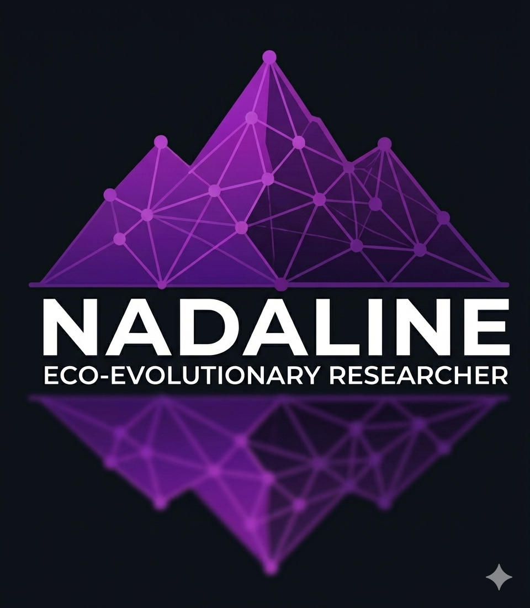

  

## Hi there, welcome! 👋

### My projects are focused on:

- **Evolutionary biology**
- **Bioinformatics**
- **Ecology**
- **Useful tutorials** for early-career scientists working on biodiversity data
- **Open science**

---

💡 *You can check out all my current projects and activities at my [gitpage](https://nadaline.github.io) (or just click on the logo above)!*
